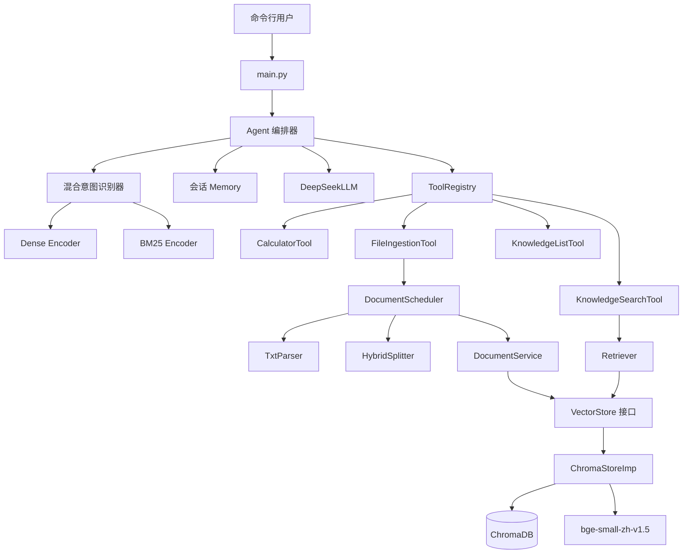
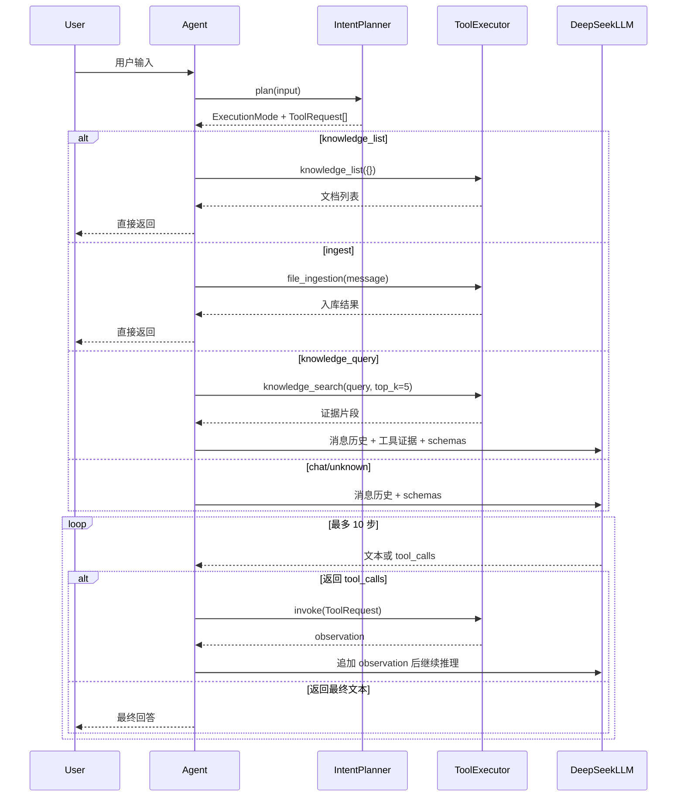
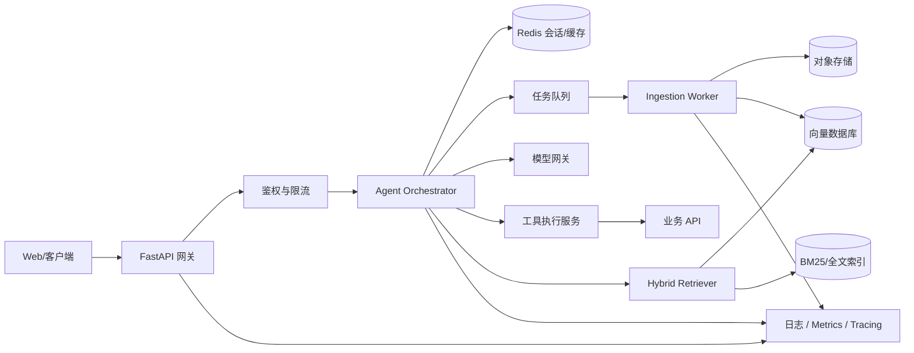

# TonyHar 项目框架与实现方法

## 1. 项目定位

TonyHar 是一个使用 Python 实现的本地知识库 Agent。项目以大语言模型为推理核心，通过语义路由判断用户意图，并把文件入库、知识库列表、向量检索和数学计算封装成可调用工具。

项目当前提供命令行交互，支持以下四类任务：

1. 普通对话和数学计算。
2. 将本地 `.txt`、`.md` 文件或目录导入知识库。
3. 查看已经入库的文档列表。
4. 检索知识库，并要求模型依据检索片段回答问题。

核心技术栈如下：

- Python 3.13、`asyncio`
- DeepSeek Chat Completions API、OpenAI 兼容 SDK
- Function Calling / Tool Calling
- `semantic-router`、Dense Embedding + BM25 混合意图路由
- `BAAI/bge-small-zh-v1.5` 中文嵌入模型
- ChromaDB 持久化向量数据库
- Sentence Transformers、PyTorch
- 基于标题结构和 token 窗口的混合切块

---

## 2. 整体架构

项目采用分层和依赖倒置的设计，将 Agent 编排、模型适配、工具协议、RAG 流水线和基础设施分开。



架构可以概括为三条主链路：

```text
对话链路：用户输入 → 意图路由 → Agent → LLM/工具循环 → 最终回答
入库链路：文件 → 解析 → 结构化切块 → metadata 标准化 → ChromaDB
问答链路：问题 → 强制知识检索 → 证据写回上下文 → LLM 基于证据回答
```

---

## 3. 目录与模块职责

```text
TonyHar/
├── main.py                         # 程序入口、依赖装配、CLI 对话循环
├── core/
│   ├── agent.py                    # Agent 编排和模型—工具循环
│   ├── intent_planner.py           # 意图到执行模式/ToolRequest 的纯计划层
│   ├── llm.py                      # LLM 抽象、DeepSeek 适配器、响应模型
│   ├── memory.py                   # 会话消息存储和窗口裁剪
│   ├── model_config.py             # embedding 模型、缓存和设备配置
│   ├── parser.py                   # 文档解析抽象及文本解析器
│   └── userIntentrecognizer.py     # Dense + BM25 混合语义路由
├── tooling/                        # Agent 与具体工具共享的稳定协议层
│   ├── base.py                     # BaseTool 接口
│   ├── decorator.py                # @tool 与函数签名 JSON Schema 推导
│   ├── models.py                   # ToolRequest / ToolResult
│   ├── registry.py                 # ToolRegistry
│   └── executor.py                 # ToolExecutor
├── rag/
│   ├── pipeline_context.py         # 入库任务上下文、进度和错误
│   ├── scheduler.py                # 解析、切块、入库的流水线调度
│   ├── splitter.py                 # Markdown/纯文本切块策略
│   ├── document_service.py         # Chunk metadata 和写入应用服务
│   ├── retriever.py                # 面向 VectorStore 的检索服务
│   ├── vector_store_base.py        # Chunk 数据模型与 VectorStore 抽象
│   └── chroma_store_imp.py         # ChromaDB 基础设施实现
├── tools/
│   ├── calculator.py               # 数学计算工具
│   ├── file_ingestion.py           # 文件/目录发现和入库工具
│   ├── knowledge_list.py           # 已入库文档清单工具
│   └── knowledge_search.py         # 知识库检索工具
├── tests/unit_test/                # Agent、路由、检索和入库单元测试
├── orginalMd/                      # 示例 Markdown 知识文档
├── data/chroma/                    # ChromaDB 持久化数据
└── requirements.txt                # Python 依赖
```

---

## 4. 程序启动与依赖装配

`main.py` 是组合根，负责创建具体依赖，而业务模块尽量依赖抽象。

启动时的装配过程：

1. 从 `DEEPSEEK_API_KEY` 环境变量读取模型密钥。
2. 创建 `DeepSeekLLM`。
3. 创建 ChromaStore、DocumentService、Retriever 和 DocumentScheduler。
4. 将这些 RAG 服务注入具体工具，再注册到 `ToolRegistry`。
5. 取得进程级共享的 `UserIntentRecognizer`，并构造 `IntentPlanner`。
6. 创建 `Agent`，注入 LLM、工具注册表、计划器和系统提示词。
7. 进入 `asyncio` 命令行循环，每次将输入交给 `Agent.invoke()`。

这种装配方式避免由 Agent 自己创建具体工具或数据库，测试时可以注入 Fake LLM、Fake Recognizer、内存 VectorStore，减少外部依赖。

---

## 5. Agent 编排的实现

### 5.1 核心状态

`Agent` 持有四类依赖和状态：

- `BaseLLM`：屏蔽具体模型供应商。
- `ToolRegistry`：提供工具 schema 和工具解析。
- `Memory`：保存 system、user、assistant、tool 消息。
- `IntentPlanner`：把识别结果转换为执行模式和 `ToolRequest`。

Agent 将最大执行步数设为 10，防止模型持续调用工具而不结束。

### 5.2 一次请求的执行流程



### 5.3 为什么知识库问题采用“强制检索”

当意图为 `knowledge_query` 时，Agent 不等待模型自己决定是否检索，而是在第一次生成前主动执行 `knowledge_search`：

1. 使用原始问题作为 query，默认取 Top 5。
2. 构造一条符合 OpenAI Tool Calling 协议的 assistant tool call 消息。
3. 将检索结果以 `tool` 消息写入 Memory。
4. 再把完整上下文交给 LLM 生成答案。

这样可以减少模型跳过检索、直接依赖参数知识回答的问题，使知识库问答链路更加确定。

### 5.4 模型适配层

`BaseLLM` 定义统一的异步 `chat(messages, tools)` 接口。`DeepSeekLLM` 使用 OpenAI 兼容协议调用 DeepSeek，并将厂商响应转换为项目内部的：

- `LLMResponse`：文本、Token 用量、结束原因、工具调用列表。
- `ToolRequest`：调用 ID、工具名、结构化参数；路由和 LLM 共用同一模型。

Agent 因此不直接依赖 OpenAI SDK 的响应类型，更换其他兼容模型时只需要新增适配器。

### 5.5 会话记忆

`Memory` 使用 OpenAI 消息格式保存上下文。消息超过窗口后，保留全部 system 消息和最近 `max_turns * 2` 条非 system 消息，默认最多 20 轮对应的窗口。

当前方案是简单滑动窗口，优点是实现直接；后续可升级为“近期消息 + 历史摘要 + 长期记忆检索”，避免直接截断重要事实。

---

## 6. 混合意图路由的实现

### 6.1 路由目标

目前定义四个业务意图：

| 意图 | 行为 |
|---|---|
| `ingest` | 将本地文件或目录导入知识库 |
| `knowledge_list` | 查看已入库文档 |
| `knowledge_query` | 先检索，再基于证据回答 |
| `chat` | 普通对话或交由模型选择工具 |

空输入、超长输入、低于阈值的输入返回 `unknown`，再交给通用 Agent 链路处理。

### 6.2 Dense + BM25

路由使用 `semantic-router` 的 `HybridRouter`：

- Dense Encoder 使用 `BAAI/bge-small-zh-v1.5`，处理语义相似表达。
- BM25 Encoder 处理文件名、路径、关键词等精确特征。
- `alpha=0.6`，即路由更侧重语义，同时保留词法信号。
- 每个意图使用独立阈值；入库和知识列表阈值较高，降低误执行风险。

这种设计比关键词 `if/else` 能覆盖更多自然表达，也比完全依赖 LLM 路由延迟更低、结果更稳定。

### 6.3 模型共享与本地缓存

`get_shared_intent_recognizer()` 使用 `lru_cache(maxsize=1)` 提供进程级单例，避免每创建一个 Agent 都重新加载 embedding 模型和构建路由索引。

`EmbeddingModelConfig` 会优先寻找 `.hf-cache` 中完整的模型 snapshot；存在本地缓存时直接读取，否则使用 Hugging Face 模型名下载。RAG 和意图路由共享同一模型配置。

---

## 7. 工具系统的实现

### 7.1 统一工具协议

工具使用 `@tool` 装饰普通函数生成 `FunctionTool`：

- 函数名成为稳定的工具名称。
- docstring 成为提供给模型的工具描述。
- 参数类型提示自动生成 JSON Schema。
- 无默认值的参数自动进入 `required`，默认值写入 schema。
- `Annotated` metadata 可补充 minimum、maximum 等 JSON Schema 约束。

`ToolRegistry` 负责注册、查询和输出 Function Calling schemas；`ToolExecutor` 只接受 `ToolRequest` 并返回结构化 `ToolResult`。工具不存在或执行异常会转换为错误码和错误信息，供 Agent 继续处理。

需要 RAG 依赖的工具使用 `create_*_tool(service)` 工厂，通过闭包捕获由 `main.py` 注入的服务；装饰器不会创建全局数据库、Retriever 或 Scheduler。

### 7.2 当前工具

#### CalculatorTool

接收数学表达式并返回计算结果。当前使用 `eval()`，只适合作为学习 Demo；生产环境需要替换成 AST 白名单解析器或专用表达式引擎。

#### FileIngestionTool

从自然语言消息中发现本地路径，支持：

- 引号包裹路径和普通空格分词路径。
- 匹配当前工作目录直属文件/目录名称。
- 目录递归扫描。
- `.txt` 和 `.md` 文件过滤。
- 单次最多处理 1000 个文件。
- 逐文件隔离错误，汇总成功数量、文档 ID 和切片数量。

该工具通过构造器接收 `DocumentScheduler`，不再自行创建 Chroma 或 RAG 服务。ChromaStore 的 embedding function 仍在首次检索或入库时延迟加载。

#### KnowledgeListTool

通过 `DocumentService → VectorStore.list_documents()` 读取文档目录，不再直接依赖 Chroma。

#### KnowledgeSearchTool

校验 query 和 `top_k`，通过 `Retriever` 查询向量存储，将统一 `Chunk` 对象转换成包含来源信息的证据列表。`top_k` 限制为 1～20，默认 5。

---

## 8. RAG 入库流水线

### 8.1 PipelineContext

`PipelineContext` 是贯穿入库过程的任务上下文，保存：

- `document_id`、文件名和原始 bytes。
- 解析后的 `RawDocument`。
- 切分后的 `Chunk` 列表。
- 业务 metadata、错误列表和 0～1 的进度。

所有阶段共享一个上下文，便于以后增加异步任务、状态持久化和失败恢复。

### 8.2 文档身份

`FileIngestionTool` 使用文件绝对路径的 SHA-1 作为 `document_id`。同一路径重复导入会得到同一文档 ID；每个 Chunk 再根据文档 ID、序号和内容生成 SHA-1 ID，并通过 Chroma `upsert` 写入。

这提供了基本的重复写入稳定性，但文件变短或切块数量减少时，旧 Chunk 不会自动清理；生产化需要“先构建新版本，再原子切换或清理旧版本”。

### 8.3 Parser

`TxtParser` 依次尝试 `utf-8`、`utf-8-sig`、`gb18030` 解码，最终以替换非法字符的方式兜底。解析结果封装为 `RawDocument`，其中包含正文、文档 ID、文件名和文件类型 metadata。

当前 `.md` 也由文本解析器读取，文档结构在后续 Splitter 阶段处理。

### 8.4 HybridSplitter

切块层使用策略模式：

- `MarkdownStrategy` 识别一至六级标题、段落和代码块，保存标题路径和原文字符位置。
- `PlainTextStrategy` 使用 token 窗口处理普通文本。
- `HybridSplitter` 选择第一个支持当前文档的策略，再统一执行 token 上限切分。

默认参数是 `chunk_size=512`、`chunk_overlap=64`。Markdown 内容会把标题路径作为前缀写入 Chunk，例如：

```text
[一级标题 > 二级标题]
当前段落正文……
```

这样即使只召回一个局部片段，模型仍能看到文档层级语义。代码块会以 `chunk_type=code` 标记，metadata 还会记录切块策略、标题路径和字符范围。

### 8.5 Scheduler 与 DocumentService

`DocumentScheduler` 按顺序执行：

```text
校验 bytes
  → Parser.parse
  → 覆盖任务级 document_id 和 metadata
  → HybridSplitter.split
  → DocumentService.prepare_chunk
  → DocumentService.index_chunks
```

进度依次更新为 0.1、0.4、0.7 和 1.0；发生异常时写入 `errors` 后继续向上抛出，由工具层按文件捕获。

`DocumentService` 负责清理 Chroma 不接受的空 metadata，并补齐 `document_id`、文件名、切片序号、标题和页码，然后调用 VectorStore。

---

## 9. 向量存储与检索

### 9.1 抽象边界

`VectorStore` 定义三个核心方法：

```python
upsert(chunks) -> int
delete_document(document_id) -> int
search(query, top_k) -> Sequence[Chunk]
```

`DocumentService` 和 `Retriever` 只依赖这个抽象，不依赖 ChromaDB。测试使用 `MemoryVectorStore`，以后可以新增 Qdrant、Milvus 或 Elasticsearch 实现，而不修改上层流程。

### 9.2 ChromaStoreImp

Chroma 实现负责：

- 创建 `PersistentClient` 和 collection。
- 自动选择 CUDA、Apple MPS 或 CPU。
- 使用 `SentenceTransformerEmbeddingFunction` 加载 BGE 模型。
- 对 embedding 做归一化，并采用 cosine 空间。
- 批量 upsert Chunk 正文和 metadata。
- 按 `document_id` 删除全部切片。
- 把查询结果重新映射为统一的 `Chunk` 对象。

数据库默认持久化在项目的 `data/chroma`，collection 名为 `documents`。

### 9.3 查询流程

```text
用户问题
  → KnowledgeSearchTool 参数校验
  → Retriever.retrieve
  → VectorStore.search
  → Chroma 对 query 生成 embedding
  → cosine 近邻检索 Top-K
  → Chunk 列表
  → 结构化工具结果
  → 写回 Agent Memory
  → LLM 基于证据生成回答
```

当前实现是单路向量召回，还没有 BM25 文档检索、Reranker、相似度阈值和 citation 组装。意图路由虽然使用 BM25，但不等于 RAG 检索已经实现混合召回。

---

## 10. 测试策略

当前单元测试覆盖了以下边界：

- 知识库问题必须在 LLM 生成前完成检索，并把结果写为 tool message。
- 意图识别的空输入、非字符串、低置信度拒识和分数保留。
- 路由训练语料包含文件名和路径表达。
- KnowledgeSearchTool 可以返回检索结果。
- 文本文件能经过 Parser、Splitter、DocumentService 写入内存 VectorStore。
- metadata 规范化会删除空值，但保留 `0` 和 `False`。

测试通过依赖注入避免加载真实模型或数据库，例如 `RecordingLLM`、`KnowledgeQueryRecognizer` 和 `MemoryVectorStore`。

当前本地验证结果：20 个测试全部通过。入库测试使用临时文件和内存 VectorStore，不依赖仓库外部 fixture、真实模型或真实数据库。

---

## 11. 当前设计亮点

1. **LLM 与业务路由结合**：高确定性的列表和入库操作直接执行，开放式任务进入 Agent 循环。
2. **知识问答强制检索**：先取得证据再生成，降低模型跳过知识库的概率。
3. **接口隔离**：Agent 依赖 `BaseLLM`，RAG 应用服务依赖 `VectorStore`，便于替换实现和测试。
4. **工具协议统一**：所有能力以 JSON Schema 暴露给模型，工具注册与执行集中管理。
5. **结构化 Markdown 切块**：保留标题路径、代码块类型和原文位置，比固定字符切块保留更多语义。
6. **模型复用和延迟初始化**：意图模型进程内共享，RAG 模型只在首次检索或入库时加载。
7. **任务上下文**：入库各阶段共享 `PipelineContext`，为进度、错误和异步化预留扩展点。

---

## 12. 当前边界与生产化方案

下面内容在面试中应表述为“已识别的改进项”，不要说成已经实现。

| 当前边界 | 影响 | 生产化方案 |
|---|---|---|
| `DeepSeekLLM.chat` 内部调用同步 SDK | 会阻塞事件循环 | 使用 `AsyncOpenAI`，增加连接/读取/总超时 |
| Calculator 使用 `eval` | 可执行任意 Python 代码 | AST 运算符白名单或安全表达式引擎 |
| ToolRegistry 只做 Python 参数展开 | schema 只约束模型，不约束服务端 | 执行前使用 JSON Schema/Pydantic 二次校验 |
| Agent 只限制最大 10 步 | 缺少时间和成本保护 | 增加总超时、Token/金额预算、重复调用检测 |
| 单个 Agent 持有一份 Memory | 多用户会话无法隔离 | 按 `session_id` 外置到 Redis/数据库 |
| Memory 仅滑动截断 | 可能丢失关键历史 | 近期窗口 + 摘要 + 可检索长期记忆 |
| 文档 ID 只基于绝对路径 | 同内容不同路径重复，内容更新语义不清 | 内容哈希 + 文档版本 + 来源 ID |
| 更新文档不清理多余旧 Chunk | 可能检索到过期片段 | 版本化索引、事务切换、成功后清理旧版本 |
| 向量查询没有返回距离/阈值 | 弱相关内容也可能进入 Prompt | 返回 score，设置阈值并支持拒答 |
| RAG 仅单路向量召回 | 编号和精确词召回可能较弱 | BM25 + Dense 混合召回 + Reranker |
| 没有 Web API 和持久任务状态 | 只能单机 CLI 使用 | FastAPI + SSE + 队列 Worker + 状态机 |
| 缺少 tracing、指标和评测集 | 难以定位质量/成本回归 | trace ID、Token/延迟指标、离线集和线上反馈 |

---

## 13. 建议的生产部署架构



生产化时建议优先完成：

1. 将模型调用改成真正的异步客户端，并补齐超时、重试和熔断。
2. 用 FastAPI 暴露会话、入库、任务状态和 SSE 流式接口。
3. 将长耗时入库放入任务队列，持久化任务状态和进度。
4. 增加会话隔离、工具幂等、权限校验和审计日志。
5. 增加混合检索、Reranker、引用和无证据拒答。
6. 建立离线评测集，并记录每一步的耗时、Token、命中文档和工具结果。

---

## 14. 面试介绍版本

### 14.1 一分钟介绍

> 我做的是一个基于 Python 的本地知识库 Agent。系统先通过 Dense Embedding 和 BM25 混合路由识别用户是在聊天、导入文件、查看知识库还是进行知识问答。Agent 本身实现了标准的模型—工具循环，工具通过 JSON Schema 注册，目前包括计算、文件入库、知识列表和向量检索。RAG 侧把解析、切块、文档服务、检索和向量存储分层，并通过 VectorStore 抽象隔离 ChromaDB。Markdown 切块会保留标题层级、代码块类型和字符位置。对于知识库问题，我没有完全依赖模型自主决定，而是在生成前强制检索 Top 5 片段并作为 tool message 写入上下文，降低模型跳过检索和直接幻觉回答的概率。

### 14.2 为什么先做语义路由，再做 Agent？

> 因为不是所有任务都需要昂贵且不确定的模型决策。查看知识列表、文件入库等任务可以在路由置信度足够高时直接执行；普通对话和开放式工具选择再进入 Agent。这样能降低延迟和 Token 成本，也能让高风险业务路径更加确定。路由使用 Dense + BM25，是为了同时覆盖自然语言语义和文件名、路径等精确表达。

### 14.3 为什么抽象 VectorStore？

> 入库和检索属于应用逻辑，Chroma 是基础设施实现。如果上层直接调用 Chroma API，未来切换 Qdrant、Milvus 或 Elasticsearch 会影响整个调用链。我定义了统一的 upsert、delete_document 和 search 接口，让 DocumentService 和 Retriever 只依赖抽象，同时单元测试可以注入内存存储，不需要启动真实 embedding 和数据库。

### 14.4 项目最值得继续优化的地方

> 第一是把同步模型调用换成异步客户端，完善总超时、重试和预算；第二是将向量召回升级为 Dense + BM25 + Reranker，并补充相似度阈值和引用；第三是把 CLI 改成 FastAPI 和异步任务架构，实现多用户会话隔离、入库状态持久化、工具幂等与 tracing。这三项分别解决并发、效果和可运维性问题。

---

## 15. 本地运行方式

```bash
python3 -m venv env
source env/bin/activate
python -m pip install -r requirements.txt
export DEEPSEEK_API_KEY="你的密钥"
python main.py
```

首次使用语义路由或知识库时需要加载 `BAAI/bge-small-zh-v1.5`。程序会优先使用项目 `.hf-cache` 下的完整本地快照，并根据环境自动选择 CUDA、MPS 或 CPU。
